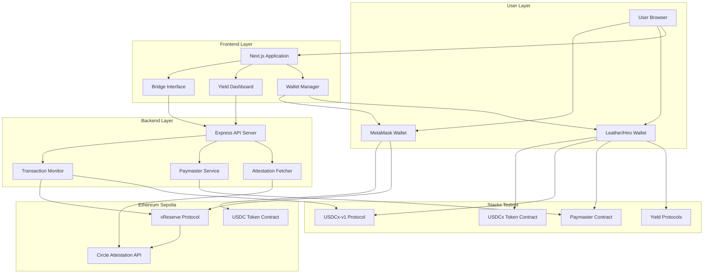
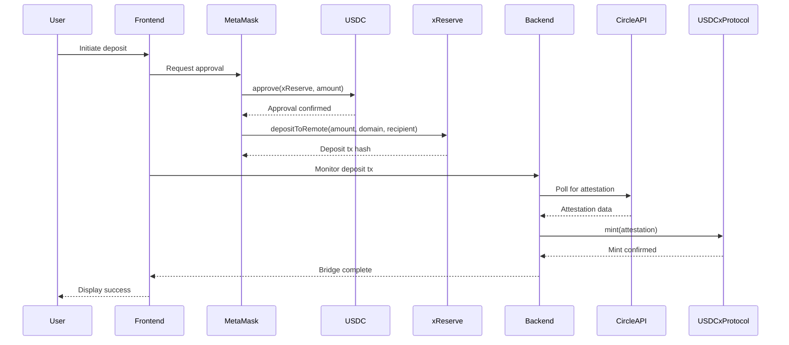
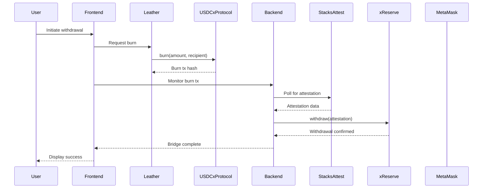

# Design Document: USDC Bridge Platform

## Overview

The USDC Bridge Platform is a production-ready cross-chain application that enables seamless transfer of USDC between Ethereum Sepolia testnet and Stacks testnet. The system leverages Circle's xReserve protocol for deposits and Stacks' attestation service for withdrawals, providing a trustless bridge mechanism backed by Circle's infrastructure.

The platform consists of three main components:
1. **Frontend Application** (Next.js): User interface for bridge operations, wallet management, and yield farming
2. **Backend Service** (Node.js/TypeScript): API server handling attestation fetching, transaction monitoring, and paymaster logic
3. **Smart Contracts** (Clarity): Paymaster contract enabling gasless transactions on Stacks

Key innovations:
- **Gasless UX**: Users can pay transaction fees in USDCx instead of STX, eliminating the need to acquire native tokens
- **Integrated Yield**: One-click access to Stacks DeFi protocols for earning returns on bridged assets
- **Real-time Monitoring**: Automated transaction tracking and attestation processing

## Architecture

### System Architecture Diagram



### Bridge Flow Architecture

**Deposit Flow (Ethereum → Stacks):**


**Withdrawal Flow (Stacks → Ethereum):**


## Components and Interfaces

### 1. Frontend Application (Next.js)

**Technology Stack:**
- Next.js 16 with App Router
- React 19
- TypeScript
- Tailwind CSS
- viem (Ethereum interactions)
- @stacks/connect (Stacks wallet integration)
- @stacks/transactions (Stacks transaction building)

**Component Structure:**

```typescript
// Core types
interface BridgeTransaction {
  id: string;
  type: 'deposit' | 'withdrawal';
  amount: string;
  sourceChain: 'ethereum' | 'stacks';
  destinationChain: 'ethereum' | 'stacks';
  status: 'pending' | 'attesting' | 'minting' | 'complete' | 'failed';
  sourceTxHash: string;
  destinationTxHash?: string;
  timestamp: number;
  ethereumAddress: string;
  stacksAddress: string;
}

interface WalletState {
  ethereum: {
    address: string | null;
    connected: boolean;
    usdcBalance: bigint;
    ethBalance: bigint;
  };
  stacks: {
    address: string | null;
    connected: boolean;
    usdcxBalance: bigint;
    stxBalance: bigint;
  };
}

interface YieldPosition {
  protocol: string;
  protocolName: string;
  depositedAmount: bigint;
  earnedRewards: bigint;
  apy: number;
  tvl: bigint;
}
```

**Key Components:**

1. **WalletConnector Component**
   - Manages MetaMask and Leather wallet connections
   - Handles network switching
   - Displays balances
   - Persists connection state

2. **BridgeInterface Component**
   - Amount input with validation
   - Network selection (Ethereum ↔ Stacks)
   - Fee estimation display
   - Gasless mode toggle
   - Transaction submission

3. **TransactionMonitor Component**
   - Real-time status updates
   - Progress indicator
   - Explorer links
   - Error handling

4. **TransactionHistory Component**
   - List of past transactions
   - Filtering and sorting
   - Detailed transaction view
   - Retry failed transactions

5. **YieldDashboard Component**
   - Available protocols list
   - APY/APR display
   - Deposit/withdraw interface
   - Position management
   - Rewards tracking

**API Client:**

```typescript
class BridgeAPIClient {
  private baseURL: string;
  
  async getTransactionStatus(txHash: string): Promise<BridgeTransaction>;
  async getAttestation(messageHash: string): Promise<AttestationData>;
  async submitSponsoredTransaction(tx: SponsoredTxRequest): Promise<string>;
  async getFeeEstimate(txType: string): Promise<FeeEstimate>;
  async getYieldProtocols(): Promise<YieldProtocol[]>;
  async getUserTransactions(address: string): Promise<BridgeTransaction[]>;
}
```

### 2. Backend Service (Node.js/TypeScript)

**Technology Stack:**
- Express.js for REST API
- @stacks/transactions for Stacks interactions
- viem for Ethereum interactions
- Node-cron for scheduled tasks
- Winston for logging

**Service Architecture:**

```typescript
// Core services
class AttestationService {
  /**
   * Fetches attestation from Circle's API
   * Polls every 30 seconds until available
   */
  async fetchCircleAttestation(messageHash: string): Promise<AttestationData>;
  
  /**
   * Fetches attestation from Stacks service
   */
  async fetchStacksAttestation(txHash: string): Promise<AttestationData>;
}

class TransactionMonitorService {
  /**
   * Monitors pending deposit transactions
   * Fetches attestations and submits mint transactions
   */
  async monitorDeposits(): Promise<void>;
  
  /**
   * Monitors pending withdrawal transactions
   * Fetches attestations and submits withdrawal transactions
   */
  async monitorWithdrawals(): Promise<void>;
  
  /**
   * Adds transaction to monitoring queue
   */
  async addTransaction(tx: BridgeTransaction): Promise<void>;
}

class PaymasterService {
  /**
   * Estimates gas fee in STX and converts to USDCx
   */
  async estimateFee(transaction: StacksTransaction): Promise<FeeEstimate>;
  
  /**
   * Constructs and submits sponsored transaction
   * Relayer pays STX, user pays USDCx
   */
  async sponsorTransaction(
    userTx: StacksTransaction,
    userAddress: string
  ): Promise<string>;
  
  /**
   * Fetches current STX/USD and USDC/USD rates
   */
  async getExchangeRates(): Promise<ExchangeRates>;
}

class YieldService {
  /**
   * Fetches yield protocol data (APY, TVL)
   */
  async getProtocolData(protocolAddress: string): Promise<YieldProtocol>;
  
  /**
   * Gets user's positions across all protocols
   */
  async getUserPositions(address: string): Promise<YieldPosition[]>;
}
```

**API Endpoints:**

```typescript
// Transaction endpoints
GET  /api/transactions/:txHash          // Get transaction status
GET  /api/transactions/user/:address    // Get user's transaction history
POST /api/transactions/monitor          // Add transaction to monitoring

// Attestation endpoints
GET  /api/attestations/circle/:messageHash    // Get Circle attestation
GET  /api/attestations/stacks/:txHash         // Get Stacks attestation

// Paymaster endpoints
POST /api/paymaster/estimate            // Estimate gasless fee
POST /api/paymaster/sponsor             // Submit sponsored transaction
GET  /api/paymaster/rates               // Get exchange rates

// Yield endpoints
GET  /api/yield/protocols               // Get available protocols
GET  /api/yield/positions/:address      // Get user positions
GET  /api/yield/apy/:protocol           // Get protocol APY

// Health check
GET  /api/health                        // Service health status
```

**Configuration:**

```typescript
interface BackendConfig {
  // Network configuration
  ethereumRpcUrl: string;
  stacksRpcUrl: string;
  
  // Contract addresses
  ethereumUsdcAddress: string;
  ethereumXReserveAddress: string;
  stacksUsdcxAddress: string;
  stacksUsdcxProtocolAddress: string;
  stacksPaymasterAddress: string;
  
  // API keys
  circleApiKey: string;
  
  // Relayer configuration
  relayerPrivateKey: string;
  relayerStacksAddress: string;
  minStxBalance: bigint;
  
  // Monitoring configuration
  attestationPollInterval: number;  // milliseconds
  maxRetries: number;
  transactionTimeout: number;       // milliseconds
  
  // Fee configuration
  paymasterMarkup: number;          // percentage (e.g., 5 for 5%)
  
  // Rate limiting
  maxRequestsPerMinute: number;
}
```

### 3. Smart Contracts (Clarity)

**Paymaster Contract (paymaster.clar):**

The existing paymaster contract provides the foundation for gasless transactions. Key functions:

```clarity
;; Pay fee in USDCx for any transaction
(define-public (pay-fee-in-usdc (usdc <sip-010>) (amount uint))
  (let ((sponsor (unwrap! tx-sponsor? ERR-NOT-SPONSORED)))
    (asserts! (is-eq sponsor (var-get relayer)) ERR-WRONG-SPONSOR)
    (contract-call? usdc transfer amount tx-sender sponsor none)
  )
)

;; Gasless withdrawal: pay fee + burn USDCx
(define-public (withdraw-gasless (amount uint) (fee uint) (recipient (buff 32)))
  (let ((sponsor (unwrap! tx-sponsor? ERR-NOT-SPONSORED)))
    (asserts! (is-eq sponsor (var-get relayer)) ERR-WRONG-SPONSOR)
    (try! (contract-call? USDC_CONTRACT transfer fee tx-sender sponsor none))
    (contract-call? USDC_CONTRACT burn amount recipient)
  )
)
```

**Contract Interactions:**

1. **USDCx Token Contract (ST1PQHQKV0RJXZFY1DGX8MNSNYVE3VGZJSRTPGZGM.usdcx)**
   - Standard SIP-010 fungible token
   - Functions: transfer, get-balance, get-total-supply

2. **USDCx Protocol Contract (ST1PQHQKV0RJXZFY1DGX8MNSNYVE3VGZJSRTPGZGM.usdcx-v1)**
   - `burn(amount: uint, recipient: buff 32)`: Burns USDCx and emits event for withdrawal
   - `mint(attestation: buff)`: Mints USDCx based on Circle attestation

3. **Ethereum xReserve Contract (0x008888878f94C0d87defdf0B07f46B93C1934442)**
   - `depositToRemote(value, remoteDomain, remoteRecipient, localToken, maxFee, hookData)`: Locks USDC and initiates cross-chain transfer

4. **Ethereum USDC Contract (0x1c7D4B196Cb0C7B01d743Fbc6116a902379C7238)**
   - Standard ERC-20 token
   - `approve(spender, amount)`: Approve xReserve to spend USDC
   - `balanceOf(account)`: Get USDC balance

## Data Models

### Transaction Data Model

```typescript
interface BridgeTransaction {
  // Unique identifier
  id: string;
  
  // Transaction type
  type: 'deposit' | 'withdrawal';
  
  // Amount in smallest unit (micro USDC/USDCx)
  amount: string;
  
  // Chain information
  sourceChain: 'ethereum' | 'stacks';
  destinationChain: 'ethereum' | 'stacks';
  
  // Status tracking
  status: TransactionStatus;
  currentStep: BridgeStep;
  
  // Transaction hashes
  sourceTxHash: string;
  destinationTxHash?: string;
  
  // Attestation data
  messageHash?: string;
  attestation?: string;
  attestationFetchedAt?: number;
  
  // User addresses
  ethereumAddress: string;
  stacksAddress: string;
  
  // Timestamps
  createdAt: number;
  updatedAt: number;
  completedAt?: number;
  
  // Error handling
  error?: string;
  retryCount: number;
  
  // Gasless transaction info
  isGasless: boolean;
  gasFeeInUsdcx?: string;
}

type TransactionStatus = 
  | 'pending'       // Initial submission
  | 'confirming'    // Waiting for blockchain confirmation
  | 'attesting'     // Waiting for attestation
  | 'minting'       // Minting/withdrawing on destination chain
  | 'complete'      // Successfully completed
  | 'failed';       // Failed with error

type BridgeStep =
  | 'approval'      // USDC approval (deposits only)
  | 'deposit'       // xReserve deposit
  | 'burn'          // USDCx burn
  | 'attestation'   // Waiting for attestation
  | 'mint'          // Minting USDCx
  | 'withdrawal';   // Withdrawing USDC
```

### Wallet State Model

```typescript
interface WalletState {
  ethereum: EthereumWallet;
  stacks: StacksWallet;
  lastUpdated: number;
}

interface EthereumWallet {
  address: string | null;
  connected: boolean;
  network: string;  // 'sepolia' for testnet
  balances: {
    usdc: bigint;   // in micro USDC (6 decimals)
    eth: bigint;    // in wei (18 decimals)
  };
}

interface StacksWallet {
  address: string | null;
  connected: boolean;
  network: string;  // 'testnet'
  balances: {
    usdcx: bigint;  // in micro USDCx (6 decimals)
    stx: bigint;    // in micro STX (6 decimals)
  };
}
```

### Yield Position Model

```typescript
interface YieldPosition {
  // Protocol information
  protocol: string;           // Contract address
  protocolName: string;       // Human-readable name
  protocolType: 'lending' | 'liquidity' | 'staking';
  
  // Position details
  depositedAmount: bigint;    // in micro USDCx
  earnedRewards: bigint;      // in micro USDCx or protocol token
  rewardToken: string;        // Token address for rewards
  
  // Performance metrics
  apy: number;                // Annual percentage yield
  tvl: bigint;                // Total value locked in protocol
  
  // Timestamps
  depositedAt: number;
  lastClaimAt?: number;
  
  // Auto-compound settings
  autoCompound: boolean;
  compoundFrequency?: number; // seconds between compounds
}

interface YieldProtocol {
  address: string;
  name: string;
  type: 'lending' | 'liquidity' | 'staking';
  apy: number;
  tvl: bigint;
  minDeposit: bigint;
  lockPeriod?: number;        // seconds, if applicable
  supported: boolean;         // Whether we support this protocol
}
```

### Fee Estimate Model

```typescript
interface FeeEstimate {
  // Gas cost in native token
  gasInStx: bigint;           // in micro STX
  
  // Equivalent cost in USDCx
  gasInUsdcx: bigint;         // in micro USDCx
  
  // Exchange rates used
  stxToUsd: number;
  usdcToUsd: number;          // Should be ~1.0
  
  // Markup applied
  markup: number;             // percentage
  
  // Timestamp
  estimatedAt: number;
  validUntil: number;         // Estimate expires after 60 seconds
}
```

### Address Encoding

**Stacks Address to bytes32:**

Stacks addresses must be encoded as 32-byte buffers for the xReserve protocol:

```typescript
// Encoding format (from Stacks docs):
// [11 zero bytes][1 version byte][20 hash160 bytes]
function encodeStacksAddress(address: string): Uint8Array {
  const stacksAddr = createAddress(address);
  const buffer = new Uint8Array(32);
  
  // 11 zero bytes (padding)
  buffer.fill(0, 0, 11);
  
  // 1 version byte
  buffer[11] = stacksAddr.version;
  
  // 20 hash160 bytes
  const hash = hex.decode(stacksAddr.hash160);
  buffer.set(hash, 12);
  
  return buffer;
}
```

**Ethereum Address to bytes32:**

Ethereum addresses are padded to 32 bytes:

```typescript
function encodeEthereumAddress(address: string): Uint8Array {
  // Remove 0x prefix and convert to bytes
  const addressBytes = toBytes(address);
  
  // Pad to 32 bytes (left-padded with zeros)
  return pad(addressBytes, { size: 32 });
}
```


## Correctness Properties

*A property is a characteristic or behavior that should hold true across all valid executions of a system—essentially, a formal statement about what the system should do. Properties serve as the bridge between human-readable specifications and machine-verifiable correctness guarantees.*

### Bridge Transaction Properties

**Property 1: Amount Validation**
*For any* bridge or yield transaction and user balance, the system should reject amounts that are zero, negative, or exceed the user's available balance, and accept all valid positive amounts within the balance.
**Validates: Requirements 1.2, 2.2, 6.4**

**Property 2: Address Encoding Correctness**
*For any* Stacks address, encoding it to bytes32 format and then decoding it should produce the original address (round-trip property).
**Validates: Requirements 1.4, 2.4**

**Property 3: Transaction State Machine Progression**
*For any* bridge transaction, the status should progress through valid states in order (pending → confirming → attesting → minting/withdrawing → complete) without skipping states or moving backwards.
**Validates: Requirements 1.5, 1.6, 1.7, 1.8, 1.9, 2.5, 2.6, 2.7, 2.8, 2.9**

**Property 4: Transaction Monitoring Completeness**
*For any* submitted bridge transaction, it should be added to the monitoring queue and remain there until it reaches a terminal state (complete or failed).
**Validates: Requirements 1.5, 2.5, 9.1, 9.4**

**Property 5: Attestation Fetch Triggers Progression**
*For any* transaction in attesting state, when an attestation becomes available and is fetched, the transaction should progress to the next state (minting for deposits, withdrawing for withdrawals).
**Validates: Requirements 1.7, 1.8, 2.7, 2.8, 9.2, 9.3, 9.5**

**Property 6: Error State Handling**
*For any* transaction that encounters an error at any step, the transaction should transition to failed status and retain error information without data loss.
**Validates: Requirements 1.10, 2.10, 10.2**

**Property 7: Transaction History Completeness**
*For any* wallet address, querying transaction history should return all transactions where that address appears as either the source or destination address.
**Validates: Requirements 3.1**

**Property 8: Transaction Display Completeness**
*For any* transaction, the display representation should contain all required fields: type, amount, timestamp, status, source chain, destination chain, and explorer links.
**Validates: Requirements 3.2, 3.4**

**Property 9: Duplicate Transaction Prevention**
*For any* pending transaction, attempting to submit an identical transaction (same user, amount, and direction) should be rejected.
**Validates: Requirements 10.6**

### Paymaster and Fee Properties

**Property 10: Fee Calculation Correctness**
*For any* STX gas amount, exchange rates (STX/USD, USDC/USD), and markup percentage, the calculated USDCx fee should equal: (gasInStx * stxToUsd / usdcToUsd) * (1 + markup/100).
**Validates: Requirements 5.4**

**Property 11: Gasless Balance Validation**
*For any* gasless transaction request, if the user's USDCx balance is less than the estimated fee, the transaction should be rejected before submission.
**Validates: Requirements 4.3**

**Property 12: Sponsored Transaction Construction**
*For any* valid gasless transaction, the constructed sponsored transaction should have the relayer as the fee payer and the paymaster contract in the transaction chain.
**Validates: Requirements 4.4, 4.5**

**Property 13: Fee Payment Atomicity**
*For any* confirmed gasless transaction, the USDCx fee transfer from user to relayer should occur if and only if the transaction succeeds.
**Validates: Requirements 4.6, 4.8**

**Property 14: Paymaster Authorization**
*For any* sponsored transaction processed by the paymaster contract, the transaction sponsor must be the authorized relayer address.
**Validates: Requirements 10.4**

**Property 15: Fee Payment Before Execution**
*For any* sponsored transaction, the paymaster contract should verify and execute the fee payment before executing the main transaction logic.
**Validates: Requirements 10.5**

**Property 16: Fee Estimate Display Completeness**
*For any* fee estimate, the display should contain base gas cost, exchange rates used, markup percentage, and total fee in both STX and USDCx.
**Validates: Requirements 5.5**

### Yield Farming Properties

**Property 17: Yield Protocol Display Completeness**
*For any* yield protocol, the display should contain protocol name, TVL, current APY, and user's deposited amount.
**Validates: Requirements 6.2**

**Property 18: Yield Deposit Execution**
*For any* valid yield deposit (amount > 0, balance sufficient), the system should call the protocol's deposit function with the exact specified amount.
**Validates: Requirements 6.5**

**Property 19: Yield Position Updates**
*For any* confirmed yield deposit or withdrawal transaction, the user's yield position should be updated to reflect the new deposited amount.
**Validates: Requirements 6.6, 6.8**

**Property 20: Yield Position Display Completeness**
*For any* yield position, the display should show deposited amount, earned rewards, and total value.
**Validates: Requirements 6.10**

### Wallet and Network Properties

**Property 21: Network Verification**
*For any* connected wallet, the system should verify that the network matches the expected testnet (Sepolia for Ethereum, Testnet for Stacks) before enabling transactions.
**Validates: Requirements 7.4**

**Property 22: Balance Display Completeness**
*For any* state where both Ethereum and Stacks wallets are connected, the system should display balances for all four tokens: USDC, USDCx, STX, and ETH.
**Validates: Requirements 7.6**

**Property 23: Wallet Disconnect Cleanup**
*For any* wallet disconnection event, all associated balance data should be cleared and related features should be disabled.
**Validates: Requirements 7.7**

### API and Backend Properties

**Property 24: API Input Validation**
*For any* API endpoint and request, all input parameters should be validated before processing, and invalid inputs should result in a 400 error with descriptive messages.
**Validates: Requirements 8.7, 8.8**

**Property 25: API Error Handling**
*For any* API endpoint that encounters an error during processing, the error should be logged and an appropriate HTTP status code should be returned.
**Validates: Requirements 8.9**

**Property 26: Rate Limiting Enforcement**
*For any* IP address, if more than 100 requests are made within a 60-second window, subsequent requests should be rejected with a 429 status code.
**Validates: Requirements 8.10**

**Property 27: Input Sanitization**
*For any* user input received by the backend, it should be sanitized to remove or escape potentially malicious content before processing.
**Validates: Requirements 10.7**

### Monitoring and Reliability Properties

**Property 28: Attestation Polling Interval**
*For any* transaction in attesting state, the monitoring service should poll the attestation API at intervals of 30 seconds (±5 seconds tolerance).
**Validates: Requirements 9.1, 9.4**

**Property 29: Timeout Alerting**
*For any* transaction that has been in a non-terminal state for more than 60 minutes, an alert notification should be generated.
**Validates: Requirements 9.6**

**Property 30: Retry Limit Enforcement**
*For any* transaction that fails, it should be retried up to 3 times, and after the 3rd failure, it should be marked as permanently failed.
**Validates: Requirements 9.7**

**Property 31: Transaction Queue Persistence**
*For any* pending transaction in the monitoring queue, after a service restart, the transaction should still be present in the queue with its state preserved.
**Validates: Requirements 9.8**

**Property 32: Relayer Balance Monitoring**
*For any* time when the relayer's STX balance falls below the configured threshold, an alert should be sent to administrators.
**Validates: Requirements 10.9**

### UI and Display Properties

**Property 33: Decimal Precision Consistency**
*For any* monetary amount displayed in the UI (USDC, USDCx), it should be formatted with exactly 6 decimal places.
**Validates: Requirements 11.6**

**Property 34: Address Display Format**
*For any* blockchain address displayed in the UI, it should be shown in shortened format (first 6 and last 4 characters) with copy-to-clipboard functionality.
**Validates: Requirements 11.8**

**Property 35: Transaction Hash Linking**
*For any* transaction hash displayed in the UI, it should be rendered as a clickable link to the appropriate blockchain explorer (Etherscan for Ethereum, Stacks Explorer for Stacks).
**Validates: Requirements 11.9**

**Property 36: Loading State Display**
*For any* transaction in progress, the UI should display a loading indicator with current step information.
**Validates: Requirements 11.3**

**Property 37: Notification Display**
*For any* completed transaction, the UI should display a success notification containing transaction details; for any failed transaction, the UI should display an error notification with actionable guidance.
**Validates: Requirements 11.4, 11.5**

**Property 38: Preference Persistence**
*For any* user preference (wallet selection, gasless mode preference), it should be saved to local storage and restored on subsequent visits.
**Validates: Requirements 11.10**

### Configuration and Deployment Properties

**Property 39: Environment Variable Validation**
*For any* required environment variable, if it is missing or invalid at startup, the backend service should fail to start with a descriptive error message.
**Validates: Requirements 12.3**

**Property 40: Relayer Address Update Authorization**
*For any* attempt to update the relayer address in the paymaster contract, it should succeed if and only if the caller is an authorized administrator.
**Validates: Requirements 12.5**

**Property 41: Critical Operation Logging**
*For any* critical operation (transaction submission, attestation fetch, error occurrence), a log entry should be created with appropriate log level and context information.
**Validates: Requirements 12.9**

**Property 42: Graceful Shutdown Preservation**
*For any* pending transaction at the time of service shutdown, after restart, the transaction should be present with its state preserved and monitoring should resume.
**Validates: Requirements 12.10**

## Error Handling

### Error Categories

1. **User Input Errors**
   - Invalid amounts (zero, negative, exceeds balance)
   - Invalid addresses (malformed Ethereum or Stacks addresses)
   - Insufficient balance for transaction + fees
   - **Handling**: Validate before submission, display clear error messages, prevent transaction submission

2. **Network Errors**
   - RPC connection failures
   - Transaction submission timeouts
   - Network congestion
   - **Handling**: Retry with exponential backoff (max 3 attempts), display network status, provide manual retry option

3. **Smart Contract Errors**
   - Contract call reverts
   - Insufficient gas
   - Contract not found
   - **Handling**: Parse revert reasons, display user-friendly messages, log full error details

4. **Attestation Errors**
   - Attestation not available after timeout
   - Invalid attestation data
   - Attestation API failures
   - **Handling**: Continue polling up to 1 hour, alert after timeout, provide manual attestation fetch option

5. **Paymaster Errors**
   - Relayer STX balance insufficient
   - Fee payment failure
   - Unauthorized sponsor
   - **Handling**: Check relayer balance before submission, alert administrators, fall back to non-gasless mode

6. **Yield Protocol Errors**
   - Protocol contract unavailable
   - Deposit/withdrawal limits exceeded
   - Protocol paused
   - **Handling**: Display protocol status, disable unavailable protocols, provide alternative options

### Error Recovery Mechanisms

**Transaction Retry Logic:**
```typescript
async function retryTransaction(
  tx: BridgeTransaction,
  maxRetries: number = 3
): Promise<void> {
  for (let attempt = 1; attempt <= maxRetries; attempt++) {
    try {
      await executeTransaction(tx);
      return; // Success
    } catch (error) {
      if (attempt === maxRetries) {
        // Final failure
        await markTransactionFailed(tx, error);
        await notifyUser(tx, error);
        throw error;
      }
      
      // Exponential backoff: 2^attempt seconds
      const delayMs = Math.pow(2, attempt) * 1000;
      await sleep(delayMs);
    }
  }
}
```

**Attestation Timeout Handling:**
```typescript
async function waitForAttestation(
  messageHash: string,
  timeoutMs: number = 3600000 // 1 hour
): Promise<AttestationData> {
  const startTime = Date.now();
  const pollInterval = 30000; // 30 seconds
  
  while (Date.now() - startTime < timeoutMs) {
    try {
      const attestation = await fetchAttestation(messageHash);
      if (attestation) {
        return attestation;
      }
    } catch (error) {
      logger.warn('Attestation fetch failed', { messageHash, error });
    }
    
    await sleep(pollInterval);
  }
  
  throw new AttestationTimeoutError(
    `Attestation not available after ${timeoutMs}ms`
  );
}
```

**Graceful Degradation:**
- If exchange rate API is unavailable, use cached rates with warning
- If yield protocol data is unavailable, hide that protocol from UI
- If gasless mode fails, fall back to standard transaction mode
- If transaction monitoring fails, provide manual status check option

## Testing Strategy

### Dual Testing Approach

The system requires both unit tests and property-based tests for comprehensive coverage:

**Unit Tests** focus on:
- Specific examples and edge cases
- Integration points between components
- Error conditions and boundary cases
- UI component rendering
- API endpoint responses

**Property-Based Tests** focus on:
- Universal properties that hold for all inputs
- Comprehensive input coverage through randomization
- State machine transitions
- Data transformation correctness
- Invariant preservation

Together, unit tests catch concrete bugs while property tests verify general correctness across the input space.

### Property-Based Testing Configuration

**Library Selection:**
- **Frontend (TypeScript)**: fast-check
- **Backend (TypeScript)**: fast-check
- **Smart Contracts (Clarity)**: Clarinet with custom property test framework

**Test Configuration:**
- Minimum 100 iterations per property test (due to randomization)
- Each property test must reference its design document property
- Tag format: `Feature: usdcx-bridge-platform, Property {number}: {property_text}`

**Example Property Test:**

```typescript
import fc from 'fast-check';

// Feature: usdcx-bridge-platform, Property 1: Amount Validation
describe('Amount Validation Property', () => {
  it('should reject invalid amounts and accept valid amounts', () => {
    fc.assert(
      fc.property(
        fc.bigInt({ min: 0n, max: 1000000000000n }), // amount
        fc.bigInt({ min: 0n, max: 1000000000000n }), // balance
        (amount, balance) => {
          const result = validateAmount(amount, balance);
          
          // Property: reject if amount <= 0 or amount > balance
          if (amount <= 0n || amount > balance) {
            expect(result.valid).toBe(false);
            expect(result.error).toBeDefined();
          } else {
            expect(result.valid).toBe(true);
            expect(result.error).toBeUndefined();
          }
        }
      ),
      { numRuns: 100 }
    );
  });
});

// Feature: usdcx-bridge-platform, Property 2: Address Encoding Correctness
describe('Address Encoding Round Trip Property', () => {
  it('should preserve address through encode/decode cycle', () => {
    fc.assert(
      fc.property(
        fc.string({ minLength: 39, maxLength: 41 }).filter(isValidStacksAddress),
        (address) => {
          const encoded = encodeStacksAddress(address);
          const decoded = decodeStacksAddress(encoded);
          expect(decoded).toBe(address);
        }
      ),
      { numRuns: 100 }
    );
  });
});

// Feature: usdcx-bridge-platform, Property 10: Fee Calculation Correctness
describe('Fee Calculation Property', () => {
  it('should calculate USDCx fee correctly from STX gas', () => {
    fc.assert(
      fc.property(
        fc.bigInt({ min: 1n, max: 1000000n }),      // gasInStx
        fc.float({ min: 0.1, max: 10.0 }),          // stxToUsd
        fc.float({ min: 0.95, max: 1.05 }),         // usdcToUsd
        fc.integer({ min: 0, max: 20 }),            // markup %
        (gasInStx, stxToUsd, usdcToUsd, markup) => {
          const result = calculateFeeInUsdcx(gasInStx, stxToUsd, usdcToUsd, markup);
          
          // Expected calculation
          const expected = BigInt(
            Math.floor(
              Number(gasInStx) * stxToUsd / usdcToUsd * (1 + markup / 100)
            )
          );
          
          // Allow 1 unit tolerance for rounding
          const diff = result > expected ? result - expected : expected - result;
          expect(diff).toBeLessThanOrEqual(1n);
        }
      ),
      { numRuns: 100 }
    );
  });
});
```

### Unit Test Coverage

**Frontend Components:**
- Wallet connection flows
- Bridge interface interactions
- Transaction status display
- Yield dashboard functionality
- Error notification display

**Backend Services:**
- API endpoint request/response handling
- Attestation fetching logic
- Transaction monitoring state transitions
- Paymaster transaction construction
- Rate limiting enforcement

**Smart Contracts:**
- Paymaster authorization checks
- Fee payment execution
- Gasless withdrawal flow
- Error conditions

### Integration Tests

**End-to-End Bridge Flows:**
1. Complete deposit flow (Ethereum → Stacks)
2. Complete withdrawal flow (Stacks → Ethereum)
3. Gasless transaction flow
4. Yield deposit and withdrawal flow

**Cross-Component Integration:**
- Frontend → Backend API communication
- Backend → Blockchain interaction
- Transaction monitoring → Attestation fetching
- Paymaster service → Smart contract interaction

### Test Data Management

**Test Wallets:**
- Dedicated test wallets with funded balances
- Separate wallets for different test scenarios
- Automated balance monitoring and refilling

**Mock Services:**
- Mock Circle attestation API for faster tests
- Mock yield protocol contracts for isolated testing
- Mock exchange rate API for predictable fee calculations

**Test Networks:**
- Ethereum Sepolia testnet
- Stacks testnet
- Local development networks for unit tests
